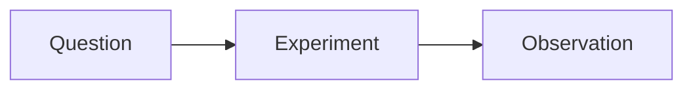

# Research notebook

> [!NOTE]
> Every result starts with a question.

```python
print(sum(range(10)))
```


```mermaid
graph LR
  Question --> Experiment --> Observation
```

Keep the source with the result.[^1]

[^1]: A good habit for future you.
